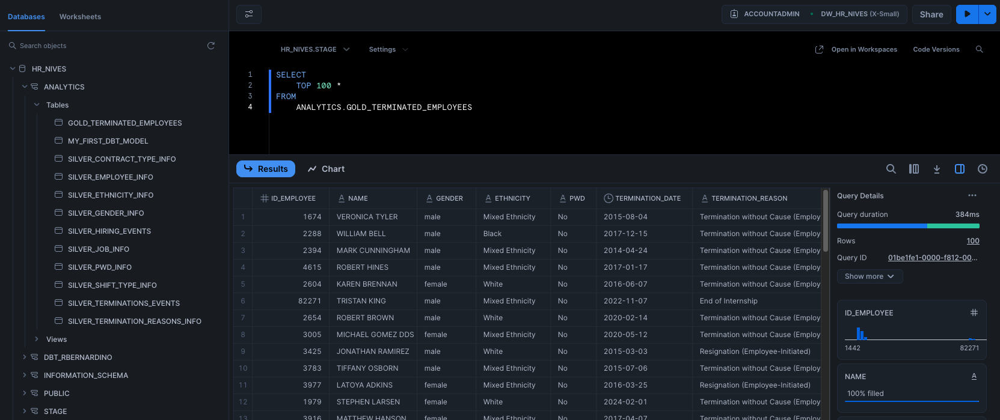
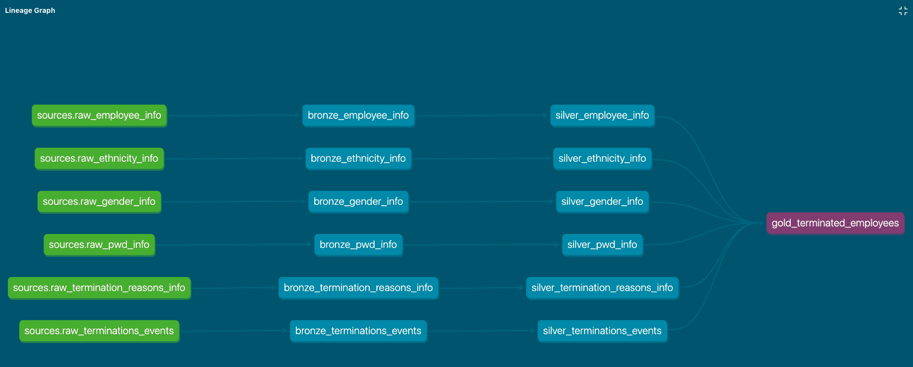
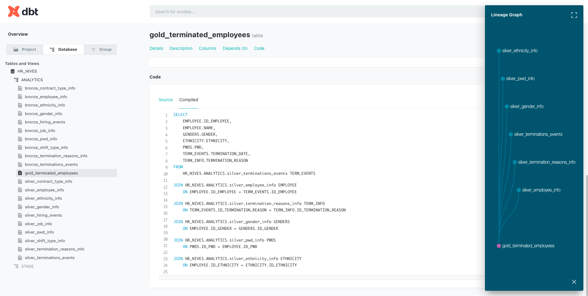

# Projeto DW - Human Resource

## Objetivo

Este projeto demonstra a construção de um Data Warehouse para o setor de Recursos Humanos da empresa Nives, para isso utilizando um pipeline de dados construido com a stack:

* **Airflow**: Orquestração e automação do pipeline.
* **PostgreSQL**: Fonte de dados transacional (OLTP).
* **Snowflake**: Data warehouse na nuvem.
* **dbt (Data Build Tool)**: Transformações de dados e modelagem do DW.

O foco é extrair dados de um banco de dados PostgreSQL local de RH, carregá-los em uma área de staging no Snowflake e, em seguida, transformar e modelar.

---

## Arquitetura do Pipeline

A arquitetura do projeto segue um padrão de **ELT (Extract, Load, Transform)**, orquestrado pelo Airflow.

1.  **Extract & Load (EL)**: O Airflow extrai dados de tabelas no PostgreSQL (schema `HR_NIVES`) e os carrega diretamente para tabelas de staging no Snowflake.
2.  **Transform (T)**: O dbt entra em ação, transformando os dados brutos na camada de staging do Snowflake em um modelo de dados dimensional (camadas `bronze`, `silver` e `gold`).

### Diagrama da Arquitetura

---

## 📁 Estrutura do Projeto

A organização do projeto segue as melhores práticas para pipelines de dados e desenvolvimento de software:
.
├── .dbt/
│   ├── dbt_project.yml     
│   ├── models/
│   │   ├── bronze/
│   │   ├── silver/
│   │   ├── gold/
│   │   └── source.yml          
│   └── 
├── .airflow/
│   ├── config/
│   ├── dags/
│   │   ├── etl_transfer_to_stage.py       
│   └── plugins/
├── .env
├── .gitignore                  
├── .python-version
├── docker-compose.yaml
├── README.md                   
├── poetry.lock
└── pyproject.toml

